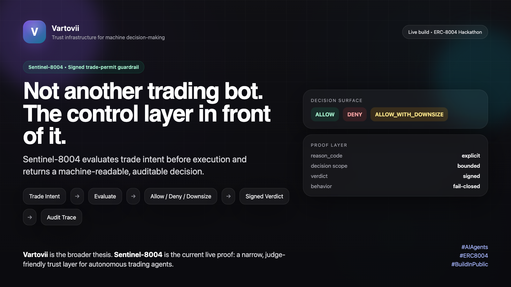

# Vartovii Sentinel-8004



> Signed trade-permit guardrail for autonomous trading agents.

Sentinel-8004 is the main hackathon project. It is the control layer in front
of an autonomous trading agent, not another trading bot. The companion trading
bot is supporting proof only and does not replace the Sentinel-first thesis.

## Quick Links

| Surface | Link |
| --- | --- |
| Demo | [sentinel-8004-judge-demo.onrender.com](https://sentinel-8004-judge-demo.onrender.com) |
| Judge | [sentinel-8004-judge-demo.onrender.com/judge](https://sentinel-8004-judge-demo.onrender.com/judge) |
| Operator | [sentinel-8004-judge-demo.onrender.com/operator](https://sentinel-8004-judge-demo.onrender.com/operator) |
| Slides | [slides/sentinel-8004-submission-deck-v2.html](slides/sentinel-8004-submission-deck-v2.html) |
| Video Script | [docs/DEMO_SCRIPT.md](docs/DEMO_SCRIPT.md) |

Note: this repo keeps the recording outline in `docs/DEMO_SCRIPT.md`. The
submitted video is distributed through the hackathon submission surface rather
than versioned inside this repository.

## Project Topology

There are two code surfaces in the broader submission story:

- `Vartovii-Sentinel-8004` (this repo)
  - the primary judged product surface
  - public MIT-safe demo, docs, schemas, and submission assets
- `sentinel-8004-agent-demo` (separate founder-run companion repo)
  - supporting proof only
  - live-market reference loop that demonstrates why Sentinel matters in front
    of execution

Judges do not need the companion repo to evaluate or run this public
submission.

## One-Line Thesis

Sentinel-8004 evaluates each trade intent before execution and returns a
machine-readable `ALLOW`, `DENY`, or `ALLOW_WITH_DOWNSIZE` decision, with signed
proof and a bounded execution path that can be inspected by judges and
operators.

## Why This Is Distinct

- control layer first, execution surface second
- public-safe proof objects instead of hidden operator logic
- realistic future path as a reusable guardrail module for agent builders

## Architecture At A Glance

Sentinel-8004 has one narrow job: decide whether an agent trade should proceed,
be blocked, or be constrained before capital moves.

The public MVP combines:

- agent identity binding and registration payloads
- real EIP-712 typed trade intent signing and verification
- deterministic trade evaluation with `ALLOW`, `DENY`, and `ALLOW_WITH_DOWNSIZE`
- signed verdicts, validation artifacts, and permit verification
- Kraken-facing execution previews and corrected paper-command compatibility
- organizer-aligned shared Sepolia anchor preparation for `AgentRegistry`

## Decision Flow

1. `Trade Intent`
   The agent or operator submits a canonical `TradeIntent`.
2. `Evaluation`
   Sentinel applies deterministic policy checks to the request.
3. `Decision`
   The result is one of `ALLOW`, `DENY`, or `ALLOW_WITH_DOWNSIZE`.
4. `Signed Proof`
   Sentinel produces a signed verdict plus a validation artifact.
5. `Permit Verification`
   The permit is checked again against the requested execution envelope.
6. `Execution Preview`
   A Kraken-facing preview shows what would be sent downstream after the permit
   gate, including any downsized executable path.

Short form:

`trade intent -> evaluation -> allow / deny / downsize -> signed proof -> permit verification -> execution preview`

## Shared Sepolia Alignment

Sentinel-8004 aligns to the organizer-provided shared ERC-8004 contracts on
Sepolia. It does not introduce self-deployed judging alternates.

| Shared Contract | Address |
| --- | --- |
| AgentRegistry | `0x97b07dDc405B0c28B17559aFFE63BdB3632d0ca3` |
| HackathonVault | `0x0E7CD8ef9743FEcf94f9103033a044caBD45fC90` |
| RiskRouter | `0xd6A6952545FF6E6E6681c2d15C59f9EB8F40FdBC` |
| ReputationRegistry | `0x423a9904e39537a9997fbaF0f220d79D7d545763` |
| ValidationRegistry | `0x92bF63E5C7Ac6980f237a7164Ab413BE226187F1` |

Network: `Sepolia`  
Chain ID: `11155111`

The shared `ValidationRegistry` address above is verified against the public
shared Sepolia config in `shared/config/shared-sepolia.ts`.

The repo now exposes two organizer-aligned, read-only surfaces:

- `GET /api/demo/shared-sepolia`
- `GET /api/demo/shared-sepolia/agent-registry-anchor/strategy-agent-demo`

It also exposes one founder-run helper:

```bash
node scripts/prepare-agent-registry-anchor.ts strategy-agent-demo
```

That helper prepares real calldata for:

`register(address agentWallet, string name, string description, string[] capabilities, string agentURI)`

This is the smallest correct on-chain anchor in the repo today: real shared
contract alignment, real calldata preparation, no hidden wallet flow.

For the full notes, read [docs/SHARED_SEPOLIA.md](docs/SHARED_SEPOLIA.md).

## Live Leaderboard Proof

As of April 7, 2026, the organizer event surface shows
`Sentinel-8004-Agent` with visible shared-contract trade activity, validation,
and reputation tracking.

This block matters because it shows that Sentinel is not only a local policy
demo. It also has organizer-facing proof alignment on the shared event
infrastructure.

This README treats the leaderboard as supporting external proof, not as the
primary product claim.

## Companion Reference Agent

The reference agent is supporting proof only.

Its purpose is to demonstrate why Sentinel matters in a more realistic trading
context:

- separate companion repository: `sentinel-8004-agent-demo`
- founder-run only
- live-market-input supporting evidence
- supporting proof for control-layer relevance
- not the main submission surface
- not a second primary product

In other words: Sentinel-8004 is the product. The companion agent is evidence
that a guardrail like Sentinel is useful in front of an execution surface.

Reference visuals already in the repo:

- [assets/screenshots/reference-agent-dashboard-header.png](assets/screenshots/reference-agent-dashboard-header.png)
- [assets/screenshots/reference-agent-dashboard-pnl.png](assets/screenshots/reference-agent-dashboard-pnl.png)

## What Is Real Today

- Real EIP-712 typed data signing and signature verification are implemented in
  the public repo.
- The hosted app exposes live judge and operator shells at stable paths.
- The proof chain is inspectable end to end:
  `TradeIntent -> Signed Intent -> Verdict -> Validation Artifact -> Permit Verification -> Execution Preview`
- Kraken-facing execution previews and corrected paper-command templates are
  derived from current public logic.
- The repo is aligned to the organizer shared Sepolia addresses and can prepare
  founder-run `AgentRegistry.register(...)` calldata.
- Canonical screenshots, slides, and artifact references are already present in
  the repository.

## Demo-Only Boundaries

- Demo fixture signing keys are public by design and are not production custody
  keys.
- The hosted surface does not hold private exchange credentials or funded live
  execution authority.
- Kraken execution remains preview or paper-compatible only. No live orders are
  placed by this public app.
- Shared Sepolia writes are not performed from the hosted demo. Broadcasting an
  `AgentRegistry` registration still requires explicit founder wallet action.
- The companion reference agent is founder-run supporting proof, not a public
  user product.

## Judge Surfaces

| Surface | Purpose |
| --- | --- |
| `/` | Hosted submission hub |
| `/judge` | Canonical judge walkthrough with proof artifacts |
| `/operator` | Narrow operator dry-run for composing and submitting intents |

The judge shell is intentionally read-only and judge-first.

The operator shell is intentionally narrow and test-oriented. It is not a
trading dashboard.

## Screenshots And Artifacts

Use these as the primary submission references:

- Cover image:
  [assets/cover/sentinel-8004-cover.png](assets/cover/sentinel-8004-cover.png)
- Canonical allow screenshot:
  [assets/screenshots/judge-demo-allow-btc-buy.png](assets/screenshots/judge-demo-allow-btc-buy.png)
- Canonical downsize screenshot:
  [assets/screenshots/judge-demo-downsize-eth-buy.png](assets/screenshots/judge-demo-downsize-eth-buy.png)
- Share card:
  [assets/social/sentinel-8004-thread-card.png](assets/social/sentinel-8004-thread-card.png)
- Slide deck HTML:
  [slides/sentinel-8004-submission-deck-v2.html](slides/sentinel-8004-submission-deck-v2.html)

For judge narration, the most reusable proof object remains the validation
artifact. For execution-rail narration, the strongest bridge is the Kraken
execution preview.

## Run Locally

```bash
npm install
npm run start
```

Open:

- `http://127.0.0.1:8787/`
- `http://127.0.0.1:8787/judge`
- `http://127.0.0.1:8787/operator`

Useful commands:

```bash
node scripts/sign-intent.ts allow-btc-buy
node scripts/verify-signed-intent.ts allow-btc-buy
node scripts/verify-permit.ts downsize-eth-buy 2500.00
node scripts/prepare-agent-registry-anchor.ts strategy-agent-demo
node --test api/tests/*.test.ts
```

## Read More

- [docs/ARCHITECTURE.md](docs/ARCHITECTURE.md)
- [docs/JUDGE_MODE.md](docs/JUDGE_MODE.md)
- [docs/ERC8004_PROOF.md](docs/ERC8004_PROOF.md)
- [docs/EXECUTION_PREVIEW.md](docs/EXECUTION_PREVIEW.md)
- [docs/KRAKEN_CLI_COMPAT.md](docs/KRAKEN_CLI_COMPAT.md)
- [docs/SHARED_SEPOLIA.md](docs/SHARED_SEPOLIA.md)
- [docs/DEMO_SCRIPT.md](docs/DEMO_SCRIPT.md)
- [docs/SUBMISSION_MEDIA.md](docs/SUBMISSION_MEDIA.md)
- [docs/SUBMISSION_FORM_FINAL.md](docs/SUBMISSION_FORM_FINAL.md)
- [assets/README.md](assets/README.md)

## Safety Note

This repository demonstrates a policy-based validation and control layer based
on configured inputs and public-safe proof objects. It does not provide legal,
compliance, or investment advice.

## License

This repository is released under the MIT License.
